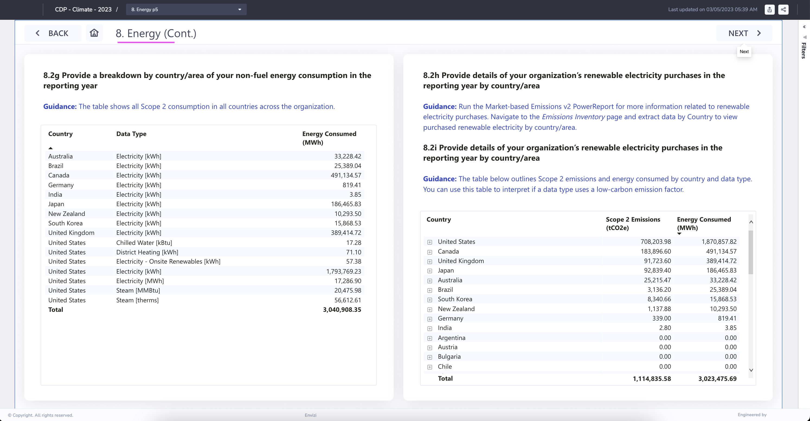

# CDP Report in Envizi

This blog explains about CDP Report in Envizi. 

## 1. Report Home

Shows the home page of the report.

## 2. Report Links

#### 2.1. Table of Content links

Clicking on particular section in the table content navigate to the details.

#### 2.2. Scope 1 link

Clicking on `Scope 1` link takes to the scope 1 details.

#### 2.3. Scope 2 link

Clicking on `Scope 2` link takes to the scope 2 details.

#### 2.4. Scope 3 link

Clicking on `Scope 3` link takes to the scope 3 details.

## 3. Report Sections

Apart from the above links there are several sections available in CDP.

The drop down box in the below picture shows the different sections available in the report. Any section can be chosen  from the list or `Next` button can be selected to navigate to the different section of the report.

Here are the various sections.

#### 3.1. Target and Performance

#### 3.2. Emission Methodology

#### 3.3. Emission Data

#### 3.4. Emission Breakdown

#### 3.5. Energy

