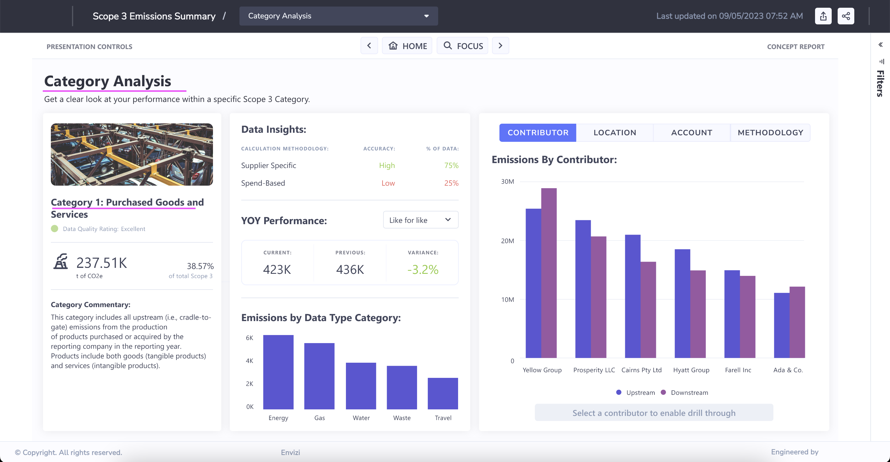

# Scope 3 emissions Report in Envizi

This blog explains about Scope 3 emissions Report in Envizi. 

This report will allow your organization to view total Scope 3 Emissions across all 15 Scope 3 Categories and will provide insight into the Calculation Accuracy of each of the methods used in your data.

## 1. Open the Report

Open the report using the Reports search

## 2. Report Home

Here is the report home page.

Click on the `>` to goto the next page

## 3. Emissions Dashboard

Select the `Category 1 - Purchased ...`  and then

Click on the `Select a category to enable drill through` button.

## 4. Category Analyis

Category Analyis get displayed.

Click on the `>` to goto the next page

## 5. Contributor Dashboard

Contributor Dashboard is displayed.

Select the `Cairns Pty Ltd`  and then

Select the `contributor to enable drill through` button

## 6. Contributor Analysis

Contributor Analysis get displayed.

Click on the `>` to goto the next page

## 7. Data Gaps and Opportunities

Data Gaps and Opportunities Analysis get displayed.

Hover the circle to see the details in the tooltip.

## 8. Various links

Here are the various links available to navigate to the above discussed screens.

