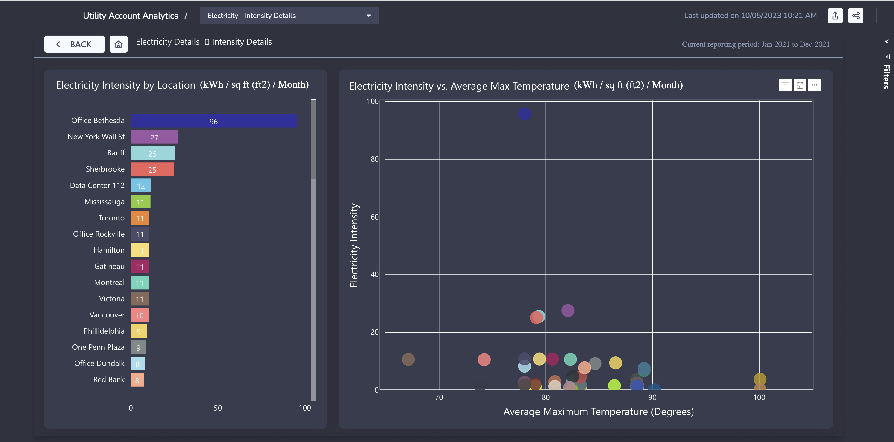

# Utility Account Analytics Report in Envizi

This blog explains about Utility Account Analytics Report in Envizi. 

## 1. Open the Report

Open the report using the Reports search

## 2. Electricity

Click on the `View Details` button under the `Electricity` section in the home page

#### 2.1 Cost

Select the `View Details` button 

See more ...

#### 2.2 Consumption

Select the `Consumption` tab

Select the `View Details` button 

#### 2.3 Emissions

Select the `Emissions` tab

Select the `View Details` button 

#### 2.4 Intensity

Select the `Intensity` tab

Select the `View Details` button 

#### 2.5 Savings

Select the `Savings` tab

Select the `View Details` button 

## 3. Gas

Click on the `View Details` button under the `Gas` section in the home page

#### 3.1 Cost

See more ...

Select the `View Details` button 

#### 3.2 Consumption

Select the `Consumption` tab

Select the `View Details` button 

#### 3.3 Emissions

Select the `Emissions` tab

Select the `View Details` button 

#### 3.4 Intensity

Select the `Intensity` tab

Select the `View Details` button 

#### 3.5 Savings

Select the `Savings` tab

Select the `View Details` button 

## 4. Water

Click on the `View Details` button under the `Water` section in the home page

#### 4.1 Cost

See more ...

Select the `View Details` button 

#### 4.2 Consumption

Select the `Consumption` tab

Select the `View Details` button 

## 5. Various links

Here are the various links available to navigate to the above discussed screens.

