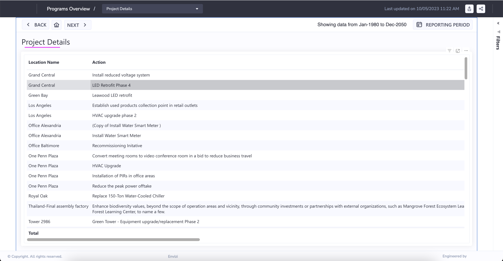

# Programs Overview Report in Envizi

This blog explains about Programs Overview Report in Envizi. 

The Programs Overview Power Report provides an overview of your Programs expected emissions, energy and cost savings. You can review Program Actions by their status, type, geography and make informed decisions based on their savings trajectories into the future. The report also provides an intensity ranking comparison to help you understand and make selections on the Programs that will achieve the highest return of investments in terms of emissions, energy and cost savings.

## 1. Open the Report

Open the report using the Reports search

Here is the home page

## 2. Savings Performance

### 2.1 Savings Summary

See more ...

### 2.2 Savings over time

### 2.3 ROl and Emissions

### 2.4 Intensity Ranking

## 3. Project Details

### 3.1 Project by Geography

See more ...

### 3.2 Project Explorer

See more ...

### 3.3 Project Details

## 4. Various links

Here are the various links available to navigate to the above discussed screens.

