# Programs Overview Report in Envizi

This blog explains about Programs Overview Report in Envizi. 

## 1. Open the Report

Open the report using the Reports search

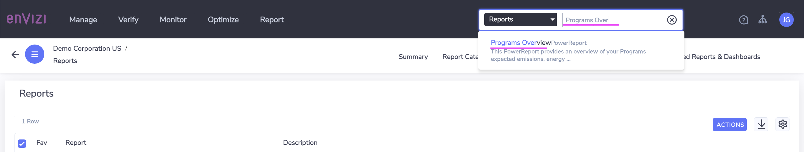

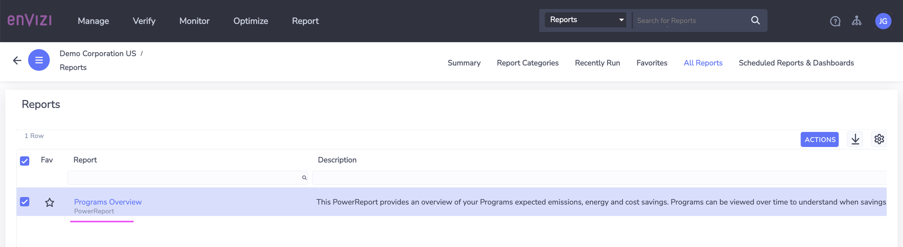

Here is the home page

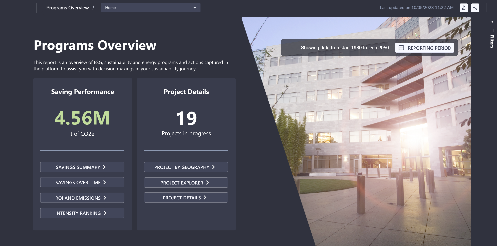

## 2. Savings Performance

### 2.1 Savings Summary

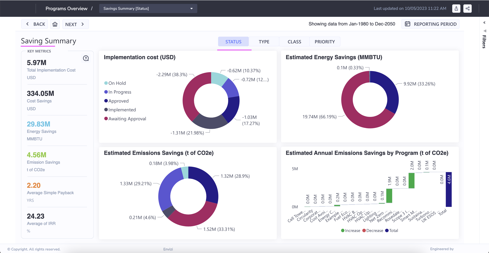

See more ...

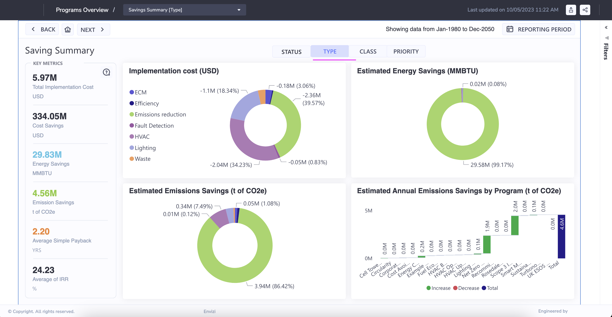

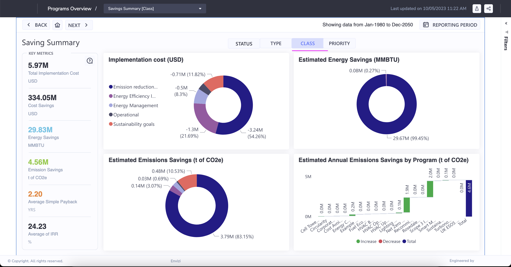

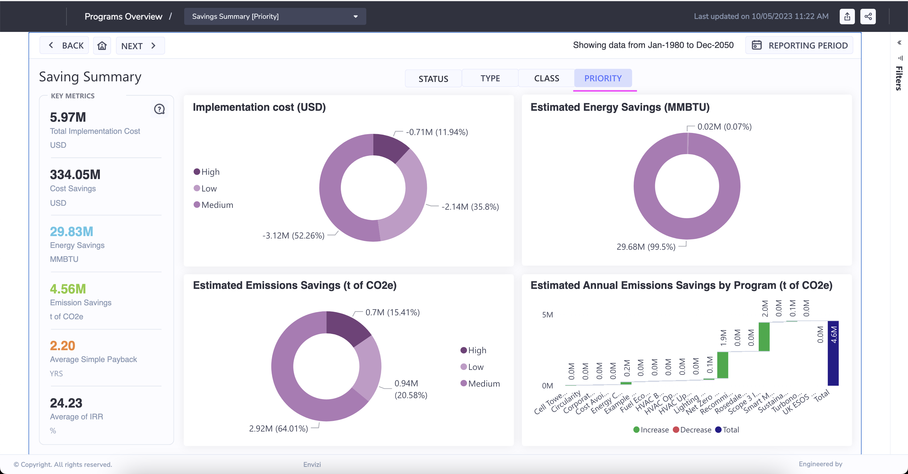

### 2.2 Savings over time

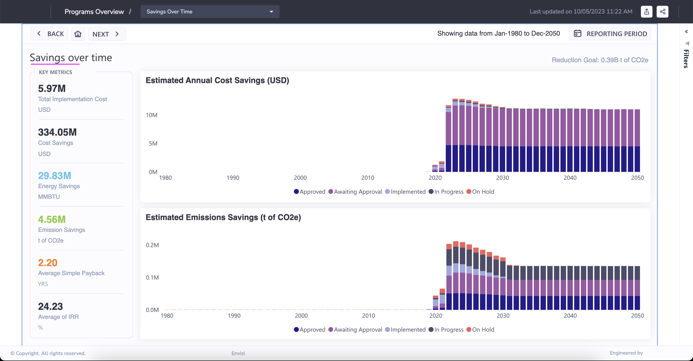

### 2.3 ROl and Emissions
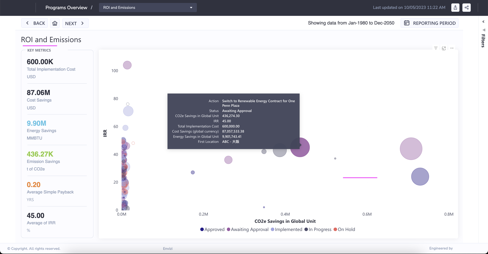

### 2.4 Intensity Ranking
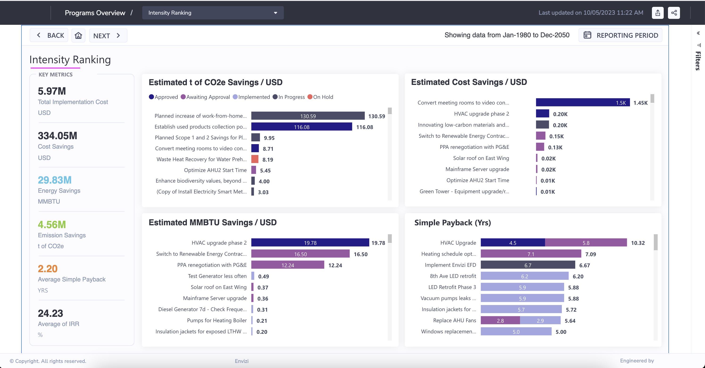

## 3. Project Details

### 3.1 Project by Geography

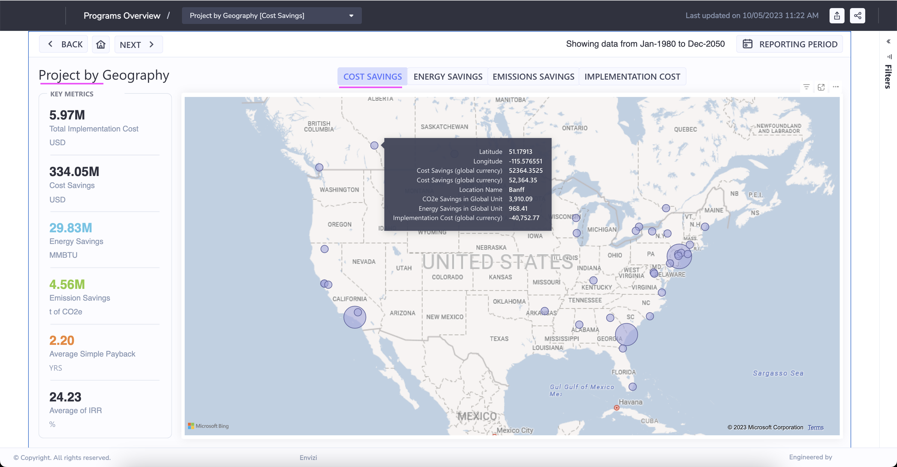

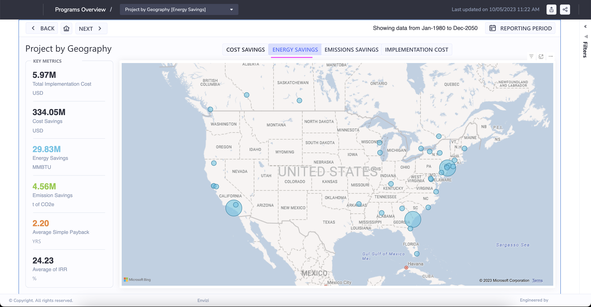

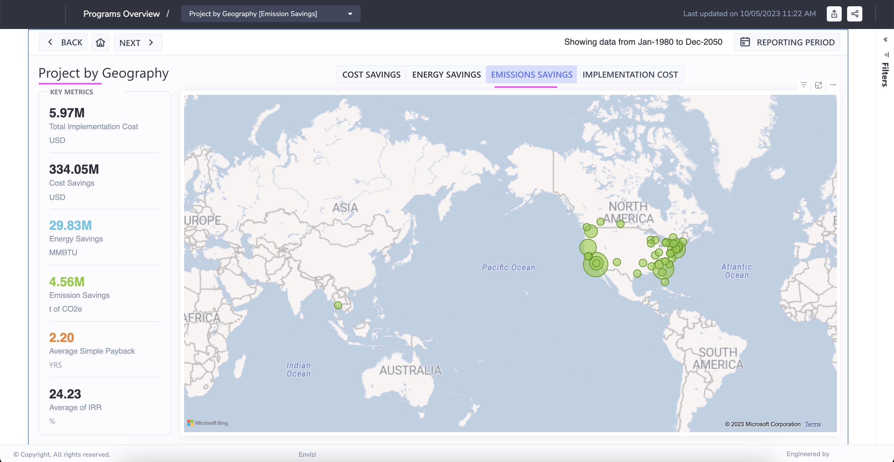

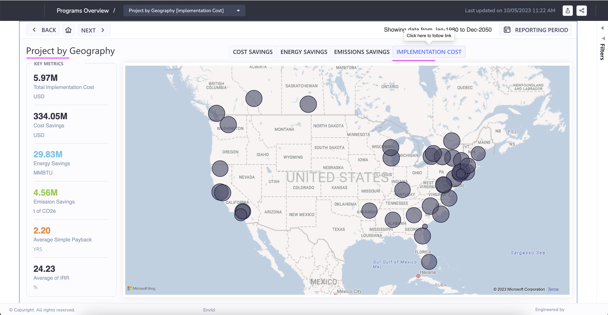

### 3.2 Project Explorer

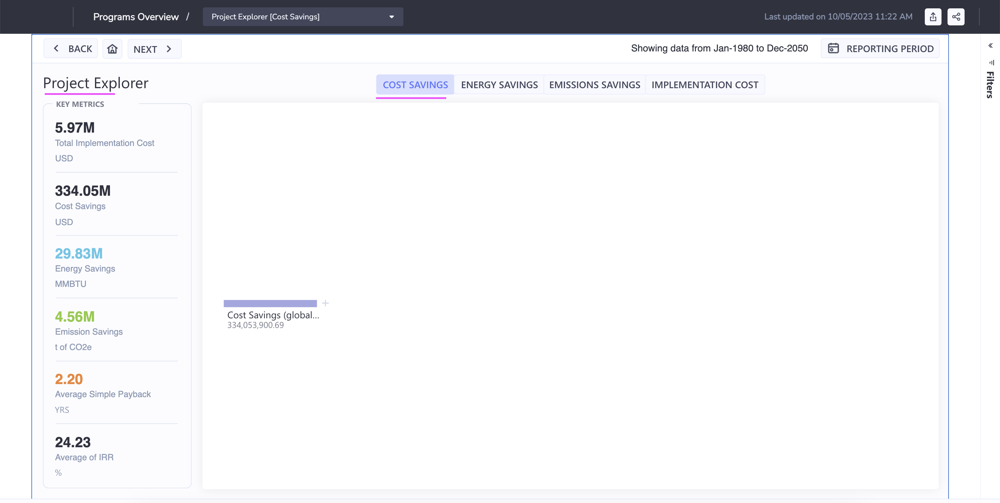

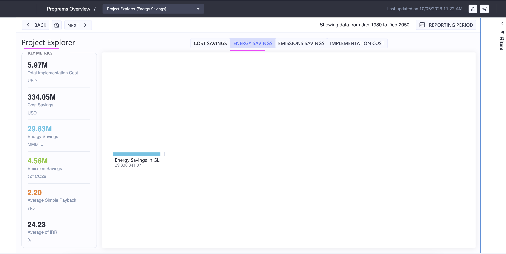

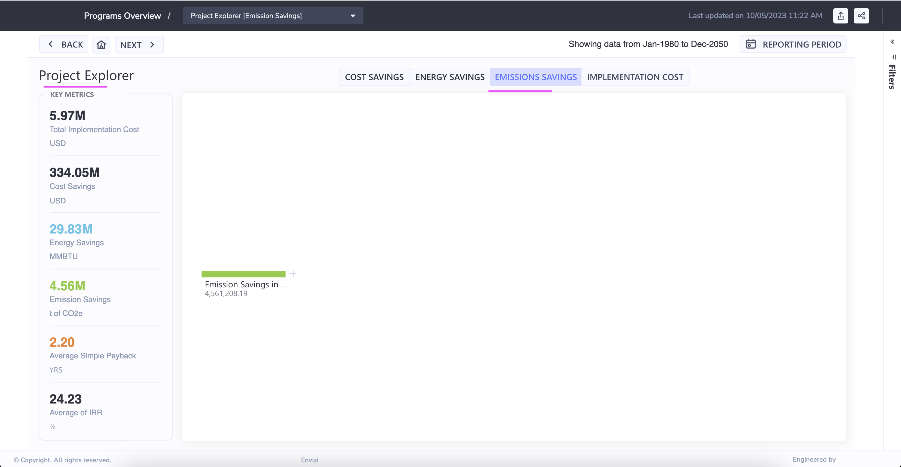

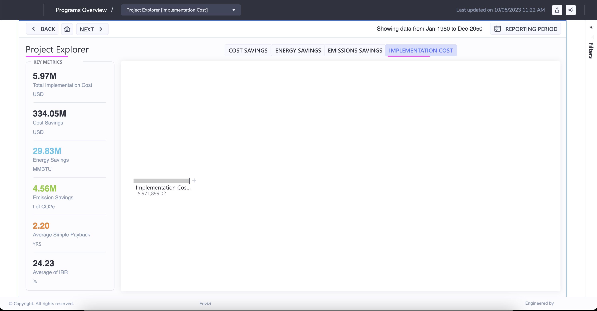

### 3.3 Project Details

## 4. Various links

Here are the various links available to navigate to the above discussed screens.

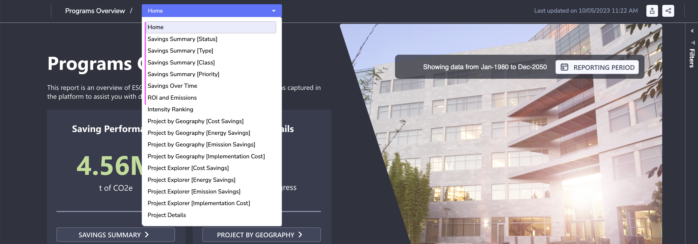