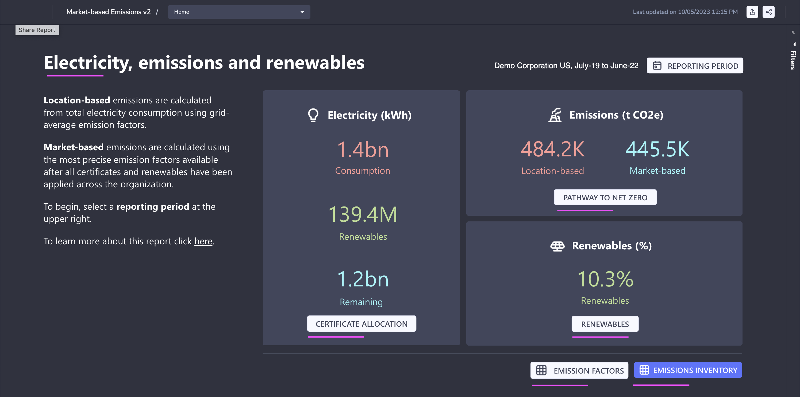
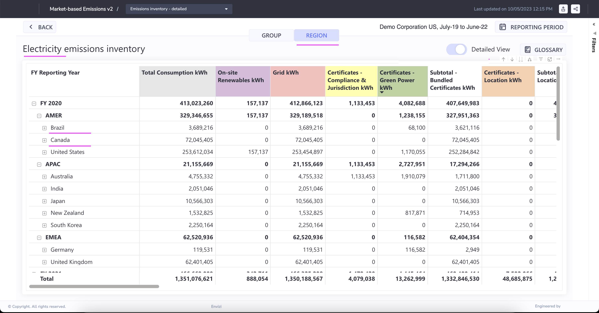

# Market Based Emissions in Envizi

This blog explains about Market Based Emissions Report in Envizi. 

## 1. Open the Report

Open the report using the Reports search

Here is the Home page

## 2. Certificate Allocation

#### Certificate Allocation

#### Certificate Allocation Detailed View

## 3 Pathway to net zero

#### 3.1 Group - By Group

#### 3.2 Group - By Location

#### 3.3 Region - By Group

#### 3.4 Region - By Location

## 4 Renewables by group

#### 4.1 Group - By Group

#### 4.2 Group - By Group Grid View

#### 4.3 Region - By Group

## 5 Emission factors

#### 5.1 CUSTOM

#### 5.2 RESIDUAL MIX

#### 5.3 LOCATION BASED

## 6 Electricity emissions inventory

#### 6.1 Group

#### 6.2 By Region

## 7. Various links

Here are the various links available to navigate to the above discussed screens.

