# Account Data Health Check in Envizi

This blog explains about Account Data Health Check Report in Envizi. 

## 1. Open the Report

Open the report using the Reports search

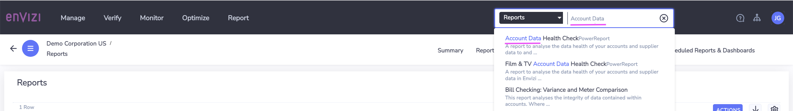

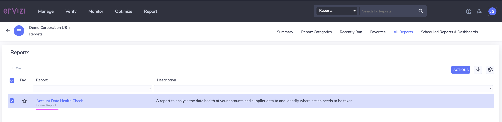

Here is the Home page

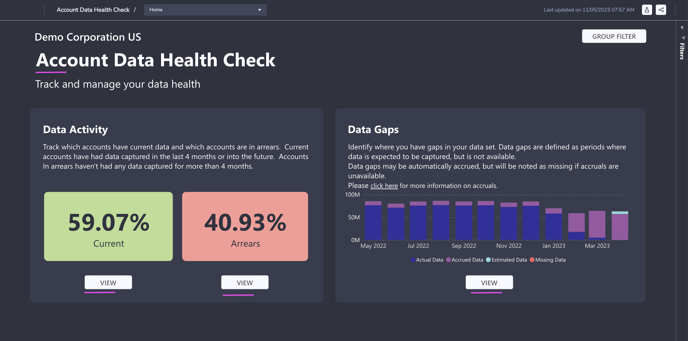

## 2. Data Activity

### 2.1 Current Accounts

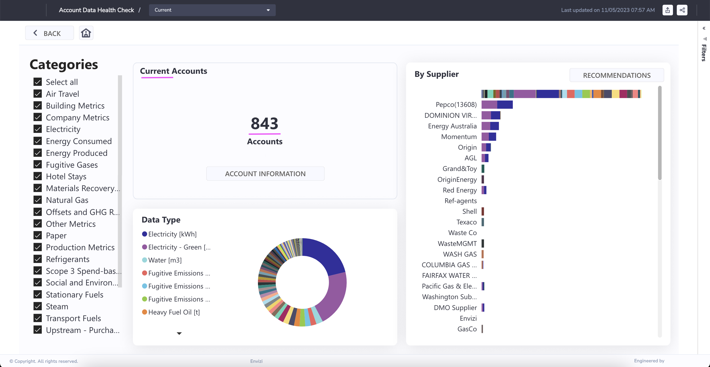

#### Social & Environmental

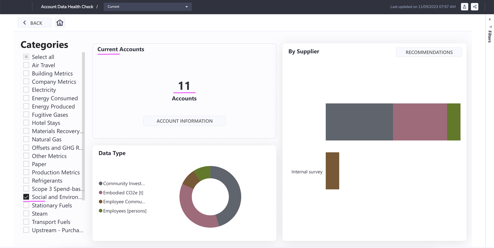

#### Accounts

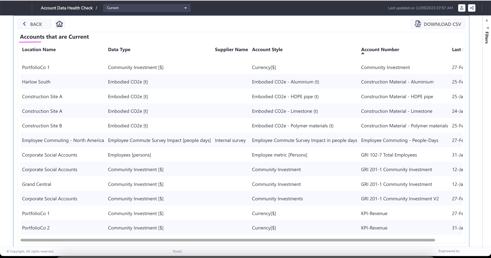

### 2.2 Accounts in Arrears

#### 5 - 12 MONTHS

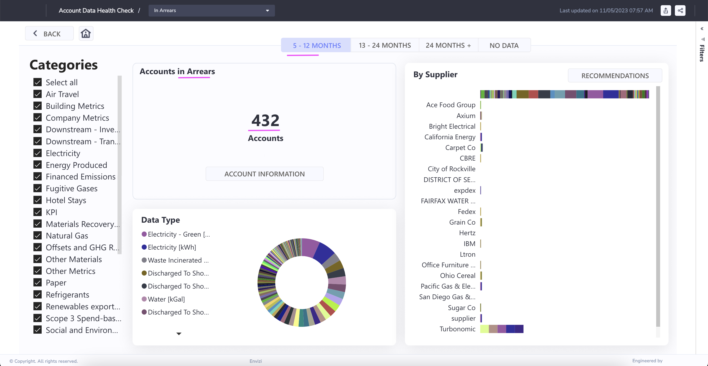

#### 13 - 24 MONTHS

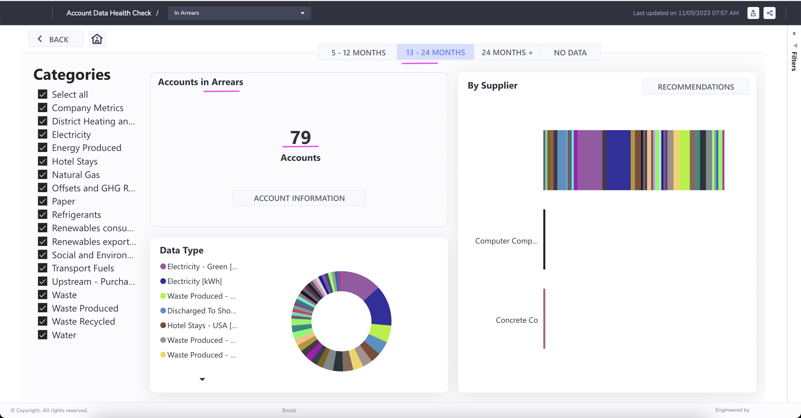

## 3. Data Gaps by Days of Data

#### 3.1 DAYS - Supplier

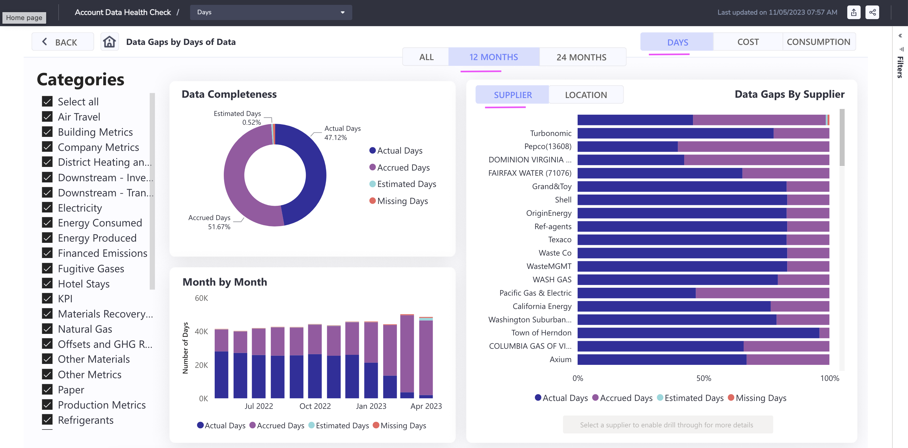

#### 3.2 DAYS - Location

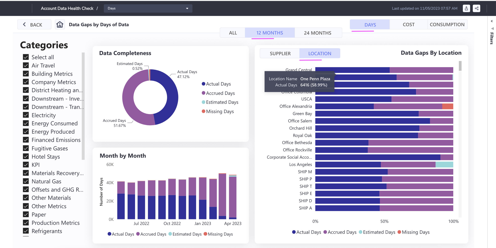

#### 3.3 COST - Supplier

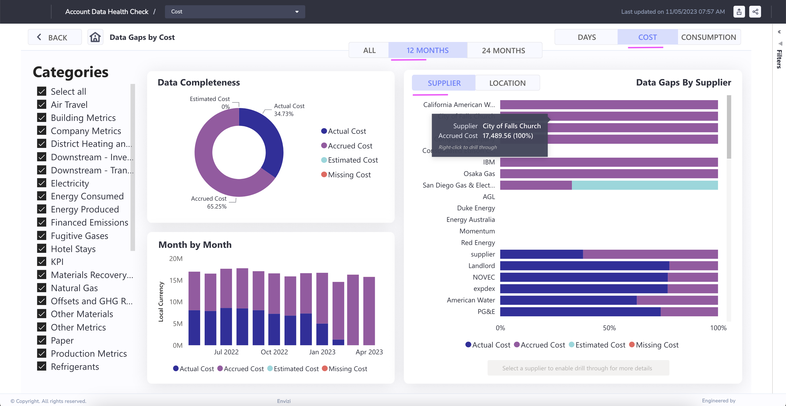

#### 3.4 COST - Location

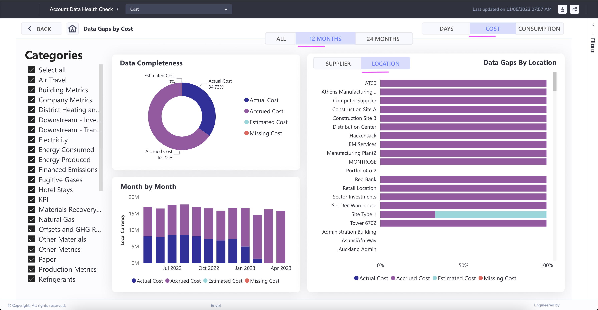

#### 3.5 CONSUMPTION - Supplier

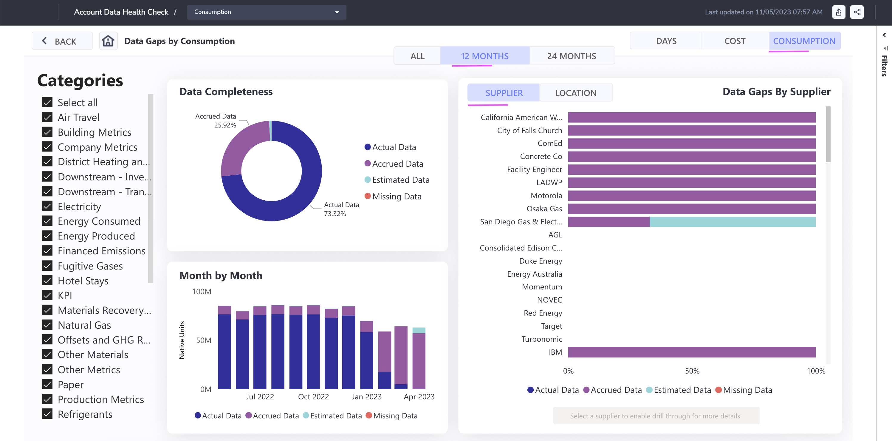

#### 3.6 CONSUMPTION - Location

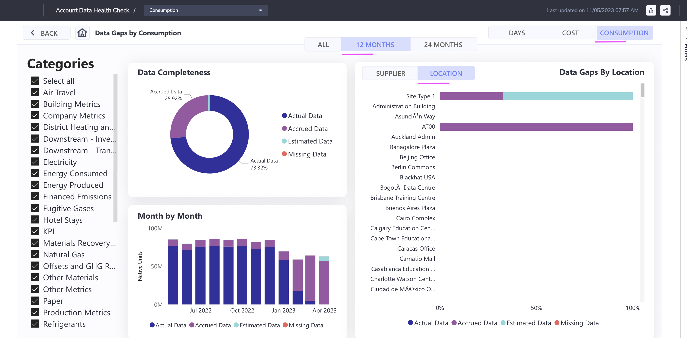

## 4. Various links

Here are the various links available to navigate to the above discussed screens.

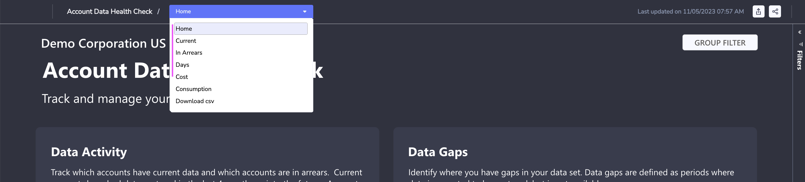