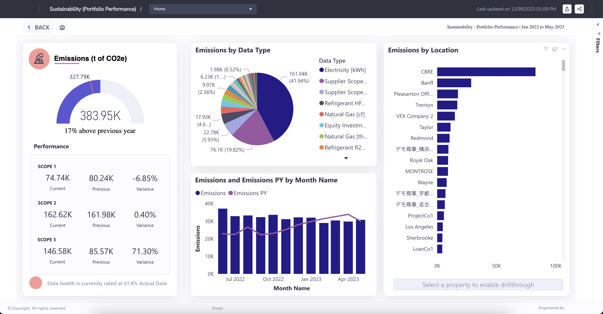
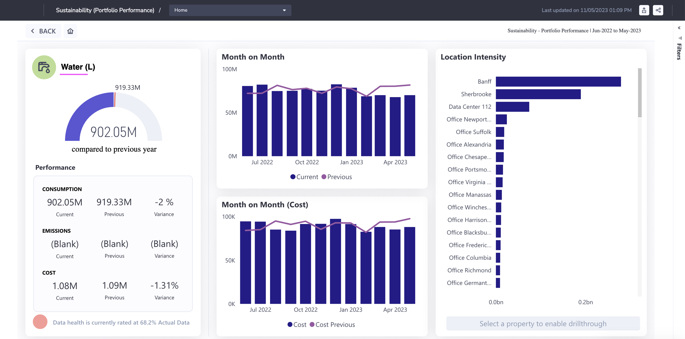

# Sustainability Portfolio Performance in Envizi

This blog explains about Sustainability Portfolio Performance Report in Envizi. 

The Sustainability (Portfolio Performance) is a PowerReport designed to provide information on key sustainability indicators across your property portfolio, including: Emissions, Electricity, Gas, Waste amd water

## 1. Open the Report

Open the report using the Reports search

Here is the Home page

## 2. Property Portfolio

### 2.1 Emissions

#### Emissions Details

### 2.2 Electricity

#### Electricity Details

### 2.3 Gas

#### Gas Details

### 2.4 Waste

#### Waste Details

### 2.5 Water

#### Water Details

## 3. Individual Property Performance

Choose any property and Click on Drillthrough button in any of these 2 screens.

It Opens up the Perormance of the Individual Property.

#### Emissions

#### Electricity

#### Gas

#### Waste

#### Water

## 4. Data Health

Click on `Data Health` button in the `Property Portfolio` page.

#### Electricity

#### Gas

#### Waste

#### Water

