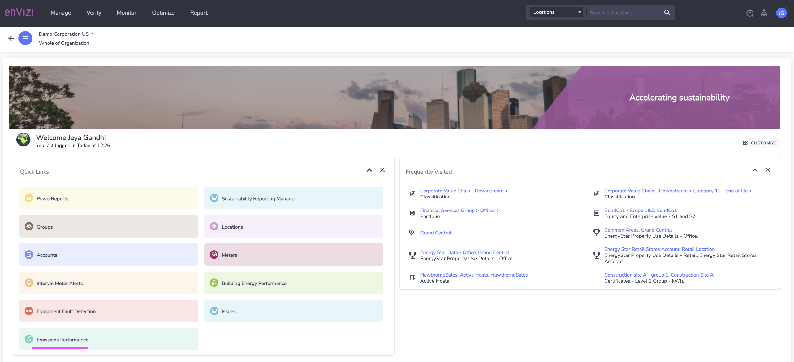
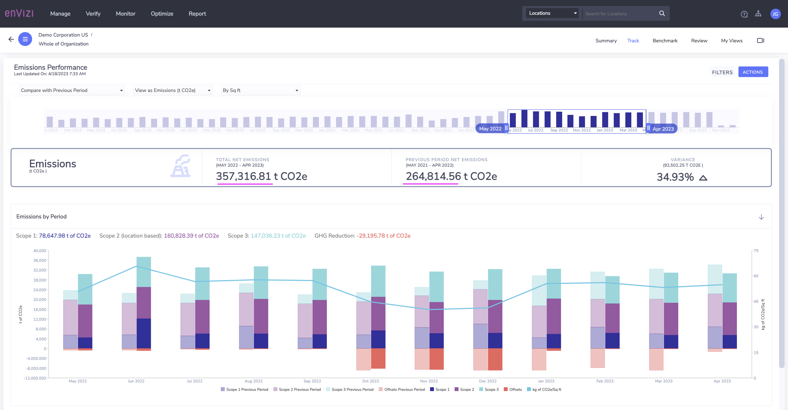
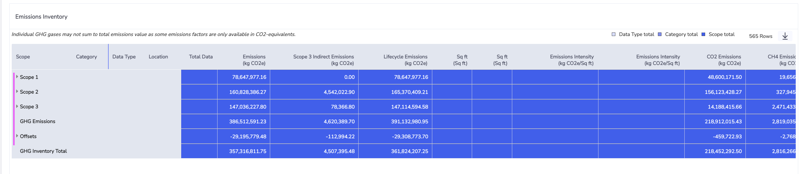
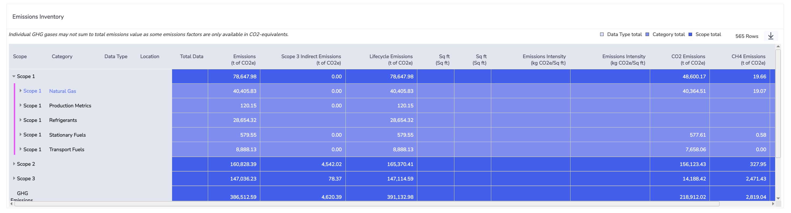
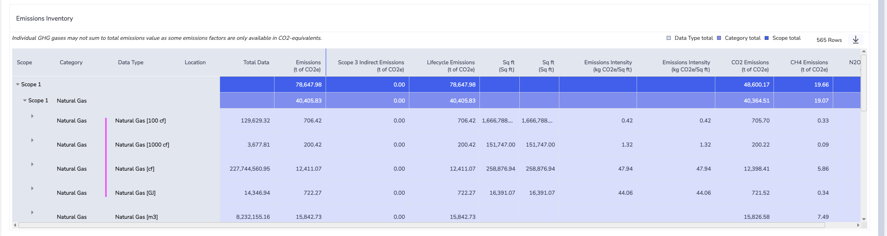
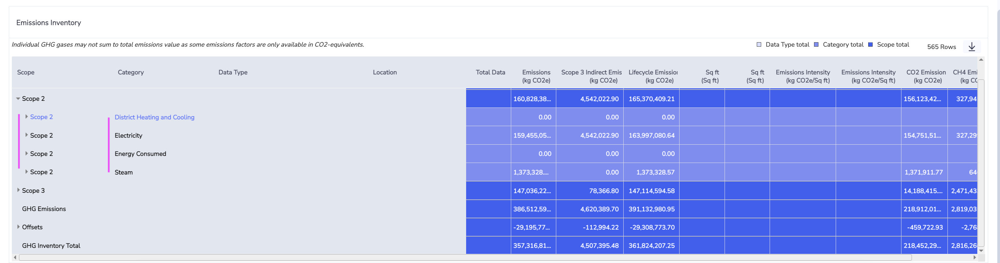
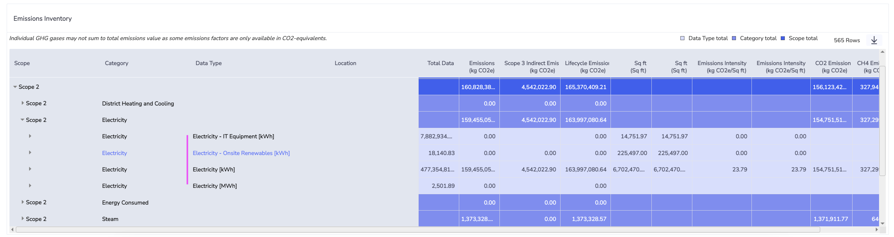
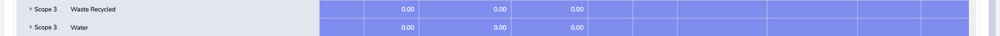
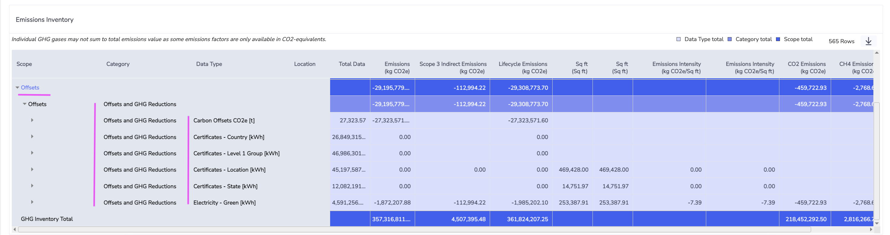
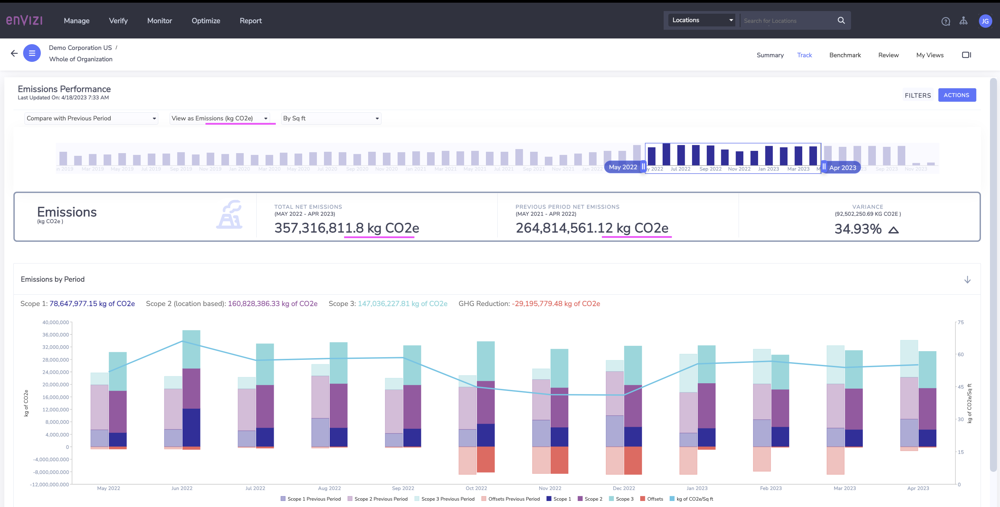

# Emission Performance in Envizi

This blog explains about Emission Performance dashboard in Envizi. 

## 1. Report Home

### 2. Scope 1

### 3. Scope 2

### 4. Scope 3

### 5. Offsets 

### 6. Comparing

