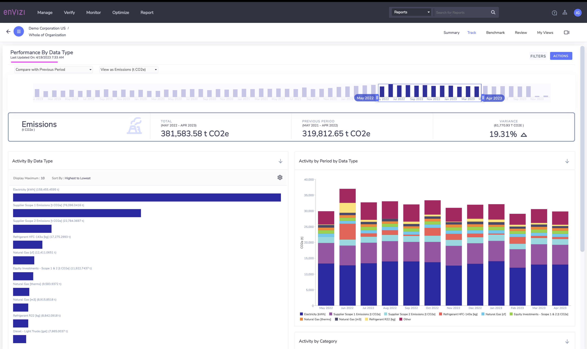

# Organization Performance in Envizi

This blog explains about Organization Performance dashboard in Envizi. 

## 1. Open the report

Org Summary

Choose the Performance Report from `Track > Performance`

## 2. Report Home

### 3. Activity by Data Type - View All

Click on `View All`

The result is displayed like this.

Download the file.

Here is the html format of the file.

Actual content of the file is available here. [01-grid_data_activity-by-datatype](./files/01-grid_data_activity-by-datatype/)

### 4. Activity by Location - View All

Click on `View All`

The result is displayed like this. Download the file.

Here is the html format of the file.

Actual content of the file is available here. [02-grid_data_activity-by-location](./files/02-grid_data_activity-by-location/)

### 5. View as Emissions

### 6. View as Cost

### 7. View by Production Volume

### 8. Compare with

### 9. Performance by data type

### 10. Performance by group

### 11. Performance by Scope

### 12. Performance by Tag Type 

### 13. Performance Trend 

### 14. Emission Performance

### 15. Engergy Production

### 16. Solar Portfolio

### 17. Org Summary

