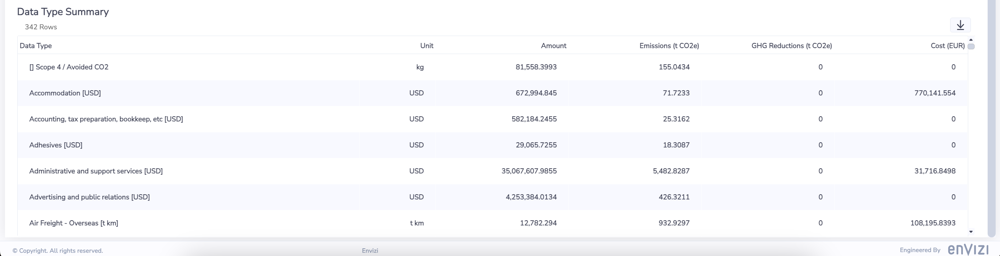

# Organization Summary Dashboard in Envizi

Here is the Organization Summary dashboard. The dashboard contains various information such as Emission, Costs, Summary and DayType Summary. 

- `Last updated On` show that time in which the data was refreshed from Envizi Data platform.
- A top left section shows the no. of locations, accounts and meters available in this organization.
- A section shows Emissions and Total cost. Also it shows the Actual/Accrued/Estimated percentages.
- Summary graph shows month wise emissions data for the last 12 months.
- Data Type Summary table shows the Emissions and Cost details for each DataType.

