# Emission Performance in Envizi

This blog explains about Emission Performance dashboard in Envizi. 

## 1. Report Home

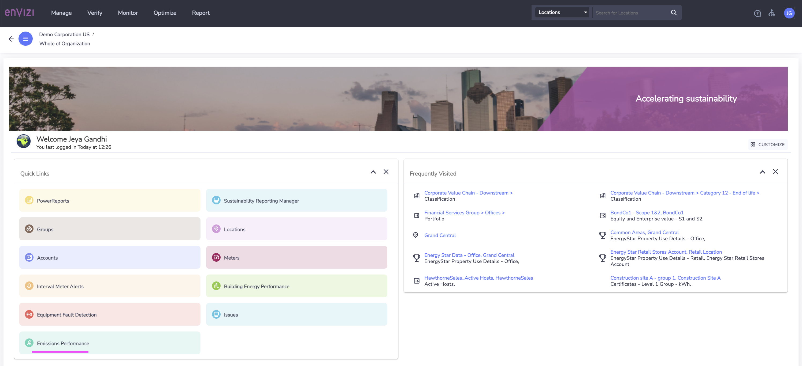

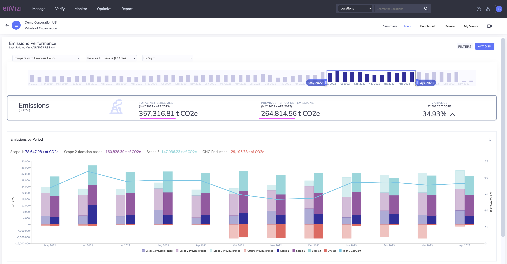
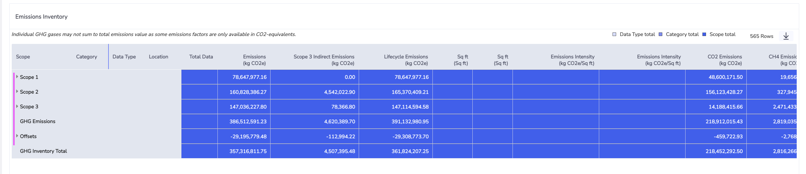

### 2. Scope 1

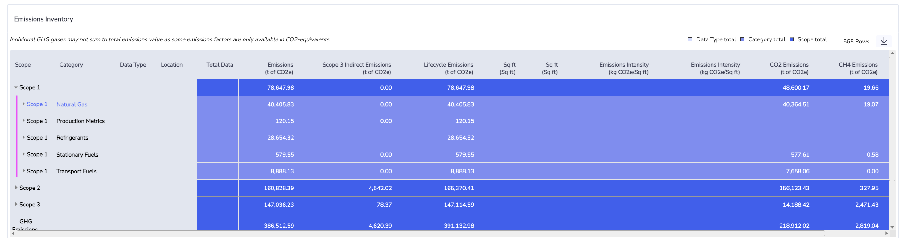
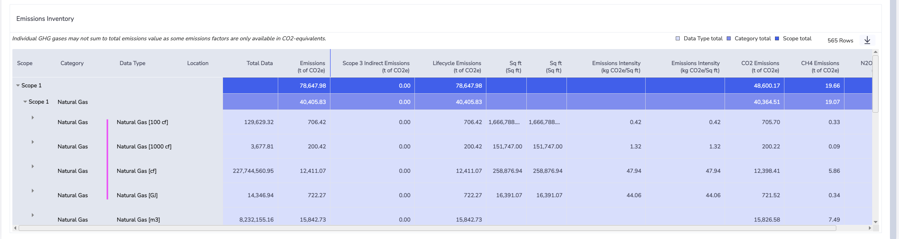
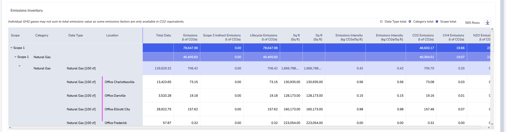

### 3. Scope 2

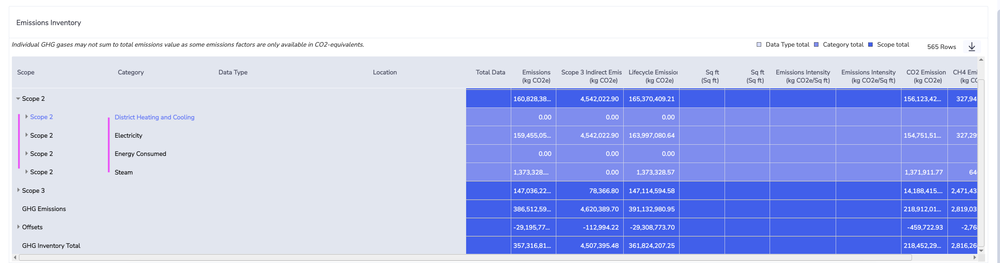
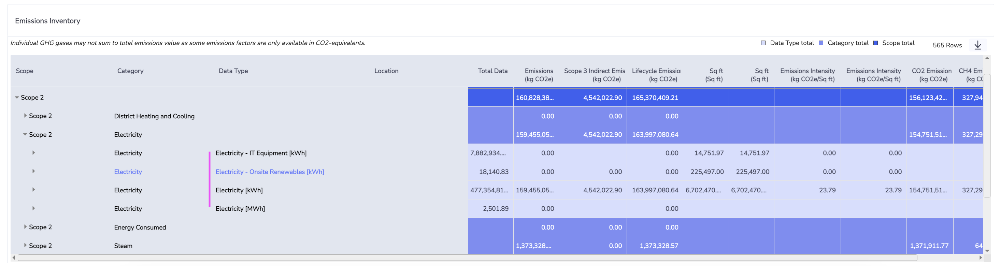
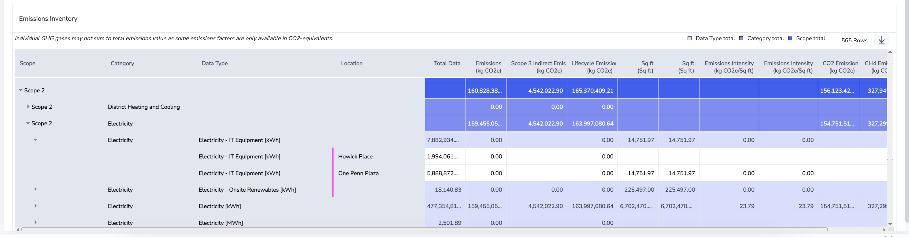

### 4. Scope 3

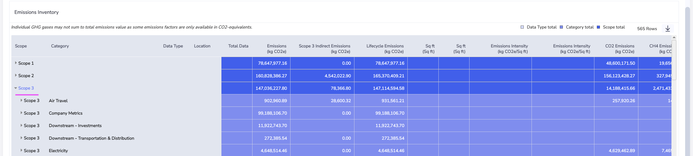
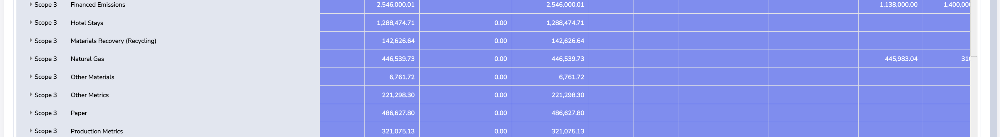
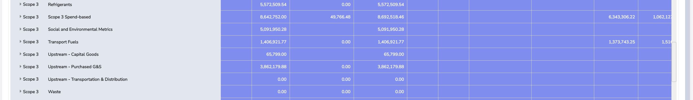
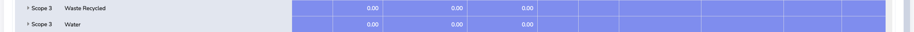

### 5. Offsets 

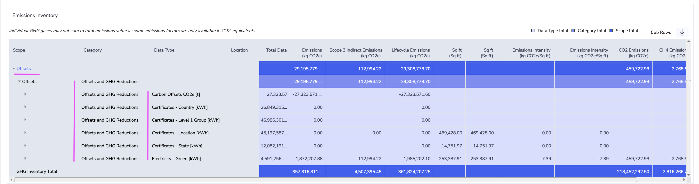
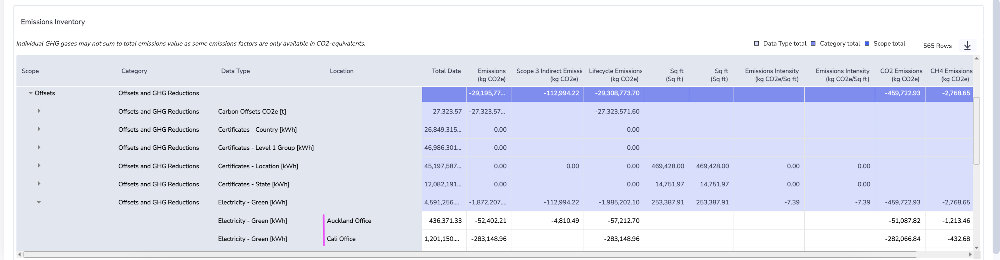

### 6. Comparing

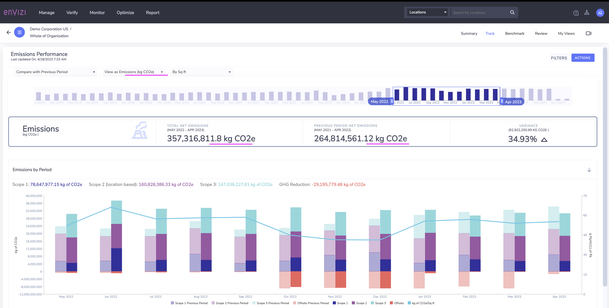
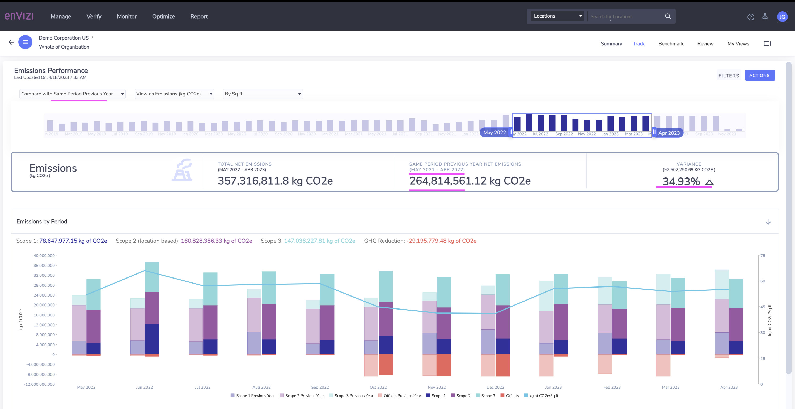
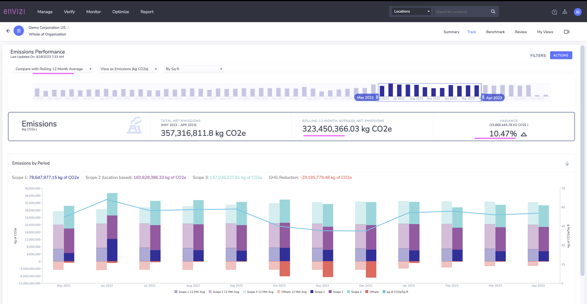
