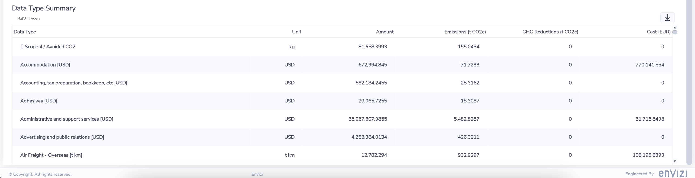
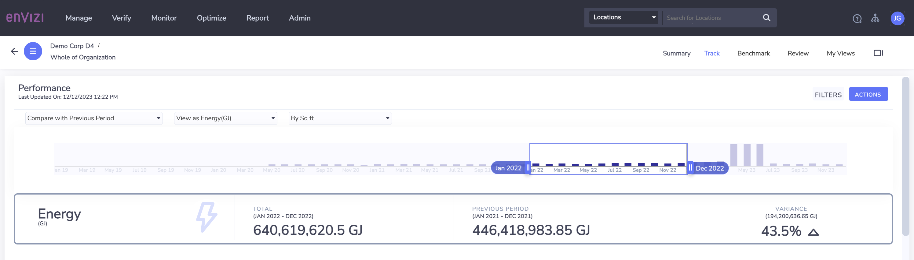
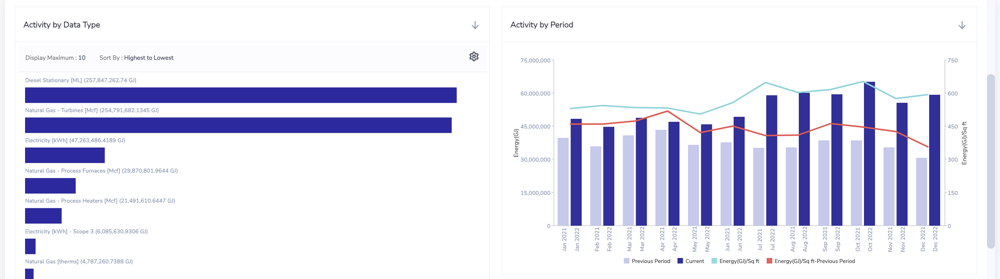
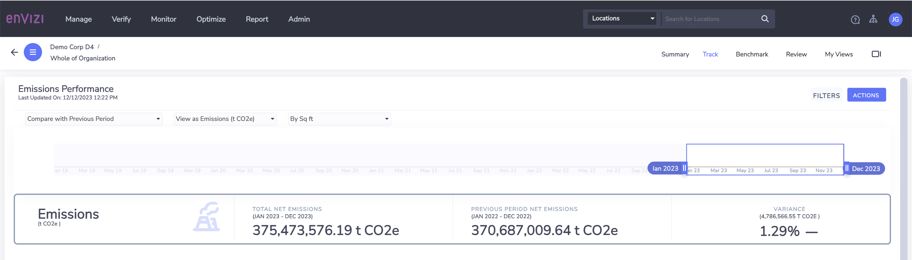
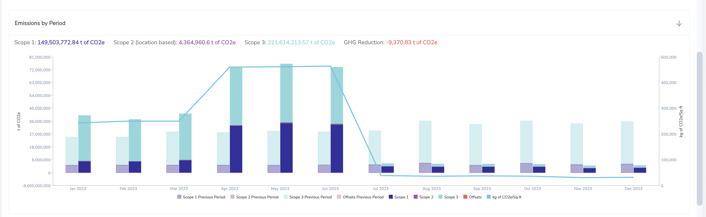
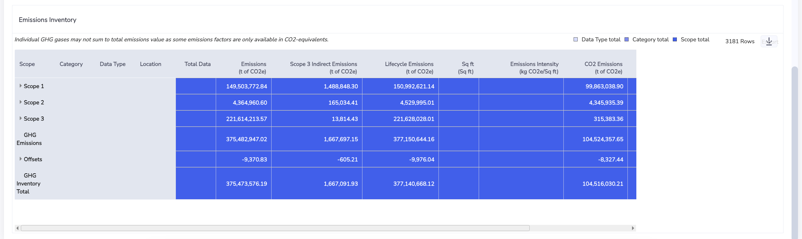
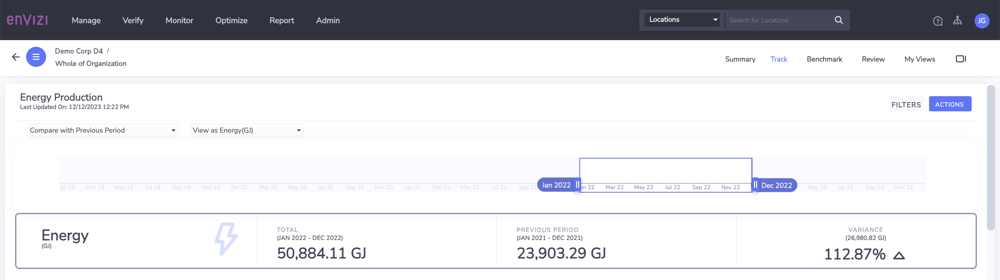
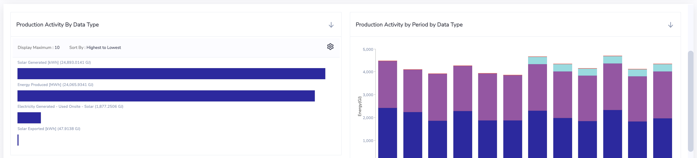
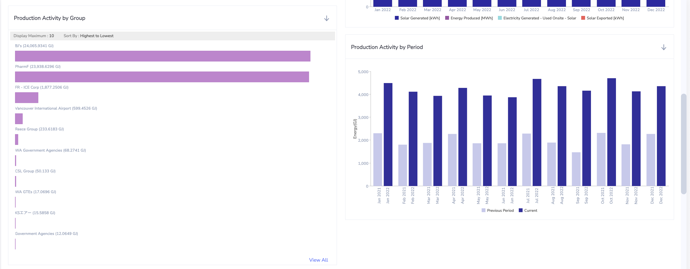
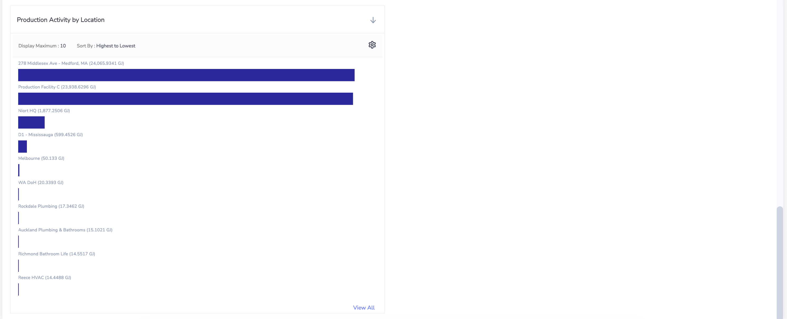

# Envizi Dashboards in Detail

Here is the Organization Summary dashboard. The dashboard contains various information such as Emission, Costs, Summary and DayType Summary. 

#### Organization Performance

Here is the Organization Performance dashboard.

#### Organization Emission Performance

Here is the Emission Performance dashboard.

#### Organization Engergy Production

Here is the Organization Engergy Production.

